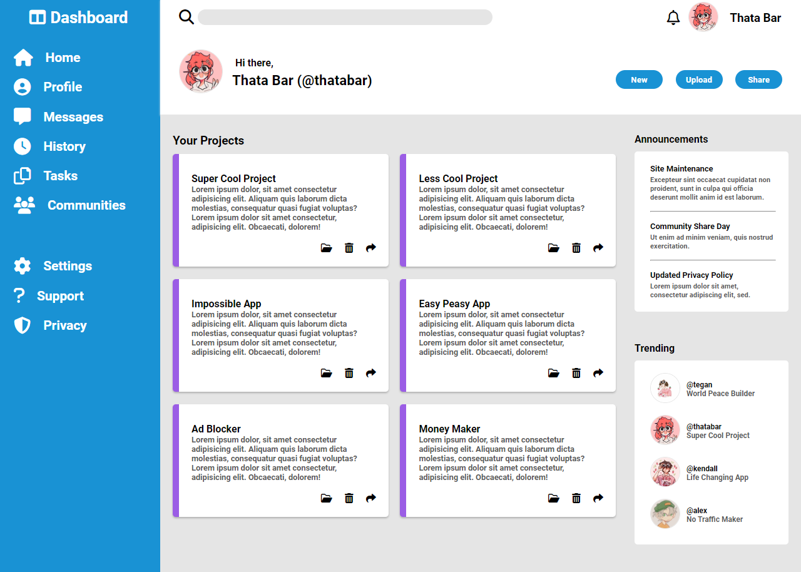

<h1 align="center">Admin Dashboard</h1>

 <a href="#-tecnologia">Technology  |</a> 
 <a href="#-projeto">Layout |</a> 
 <a href="#-layout">Project |</a> 
 <a href="#memo-liceça">License</a> 

 

 

## 🎨 Layout

 

## 🚀 Tecnologias

This project was developed with the following technology:

- HTML and CSS
- Git and Github

## 💻 Project

I built an Admin Dashboard to train CSS grid. (tutorial on The Odin Project)

Live Preview: https://barbosathaissa.github.io/Admin-Dashboard/

## :memo: Licença

This project is under the MIT license

Made with 💜 by myself : [My contact!] [mariathatha03@gmail.com]
